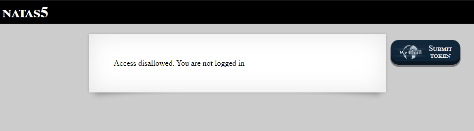
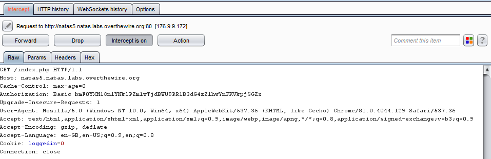

So apparently we aren't logged in. How are theses things usually handled? Let's check what happens when we intecept the request through burp: 

Oh, let's check what happens if we just change the loggedin value to 1. Huh, it's that easy to get logged in, good job!