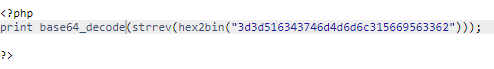

When we open the natas8 page, we are greeted with a form and a link to the source code, as we've seen before. So let's just analyse the logic that controls the form.

```php
<?

$encodedSecret = "3d3d516343746d4d6d6c315669563362";

function encodeSecret($secret) {
    return bin2hex(strrev(base64_encode($secret)));
}

if(array_key_exists("submit", $_POST)) {
    if(encodeSecret($_POST['secret']) == $encodedSecret) {
    print "Access granted. The password for natas9 is <censored>";
    } else {
    print "Wrong secret";
    }
}
?>
```


This might seem confusing and really challenging if you're just starting out but fear not, this isn't really that complicated, it just encodes the secret into base64, reverses the string and then turns the **bin**ary into **hex**adecimal. You might not be completely familiar with base64 or converting binary to hexadecimal but thankfully php (the language in which this is written) has functions that solve this problem. You just need to turn **hex**adecimal to **bin**ary, reverse the string and then decode the data in base64, as seen in the image below.


